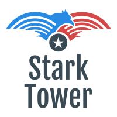

# 

# Angular Crud

Stark Access Tags is a project to management  entry / exit of people in the Stark Tower.

## Build

Run `ng build` to build the project. The build artifacts will be stored in the `dist/` directory. Use the `--prod` flag for a production build.

## Contributing
Pull requests are welcome. 

## License
[MIT](https://choosealicense.com/licenses/mit/)
